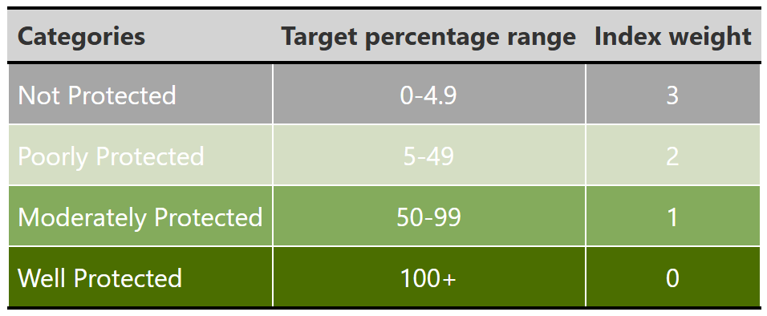

# Plant Protection Level
Lize von Staden
2025-08-26

- [Introduction to the Protection Level
  indicator](#introduction-to-the-protection-level-indicator)
- [Calculating the Protection Level indicator for
  plants](#calculating-the-protection-level-indicator-for-plants)
- [Recommended citation](#recommended-citation)
- [References](#references)

## Introduction to the Protection Level indicator

Protection Level is one of the headline indicators of South Africa’s
[National Biodiversity
Assessment](https://www.sanbi.org/biodiversity/building-knowledge/biodiversity-monitoring-assessment/national-biodiversity-assessment/)
(NBA), a report on the status of the country’s biodiversity. The report
is produced by the South African National Biodiversity Institute
(SANBI), to support national decision-making on environmental policy, as
well as reporting on South Africa’s commitments to the Convention on
Biological Diversity (CBD).

Protection Level measures the contribution of South Africa’s protected
area network to meeting conservation targets for species and ecosystems.
Ecosystem Protection Level was calculated for the first time in 2004[^1]
and Species Protection Level was calculated for the first time in
2018[^2].

Species are classified into four categories, based on the percentage of
their conservation target
(<a href="#tbl-plcats" class="quarto-xref">Table 1</a>):

Table 1

  
Protection Level categories {#tbl-plcats}

An additional feature of the Species Protection Level indicator is that
it not only considers species representation in protected areas, but
also the effectiveness of protected areas in mitigating pressures on
species’ populations within them. Studies of the conservation impact of
protected areas indicate that effective protected area management is as
important for long-term species persistence as expansion of habitat
protection.[^3],[^4],[^5],[^6]
Therefore it is more difficult for species to be classified as Well
Protected if the protected areas where they occur are not also
effectively managed.

To quantify the impact of protected area effectiveness on the species
Protection Level assessment, as well as track changes in species
protection over time, Protection Level categories are combined into a
Species Protection Index (SPI). The SPI is a number between 1 and 0,
where 1 means that all species are Well Protected (meeting their
conservation targets within the protected area network), while 0 means
that all species are Poorly Protected (meeting between 0 and 5% of their
conservation targets.

Species Protection Index is now also a [component indicator for Target
3](https://www.cbd.int/gbf/targets/3) of the CBD’s Kunming-Montreal
Global Biodiversity Framework.

## Calculating the Protection Level indicator for plants

South Africa has more than 20 000 indigenous plant species, which makes
calculating a comprehensive Protection Level indicator challenging. The
plant Protection Level indicator therefore follows a sampled approach,
similar to what is recommended for calculating a Red List Index for
highly speciose taxon groups[^7]. A random sample of 900 species were
selected from the indigenous flora, with the same sample used to
calculate South Africa’s national plant Red List Index as well as the
plant Species Protection Level indicator.

This repository documents the process of calculating Protection Level
for the plant sample, including data preparation steps. The process is
coded in R, and scripts for each step in the process are stored in the
folder [workflow](workflow/). Further technical documentation on setting
conservation targets for plants, the application of protected area
effectiveness in the assessment, and controlling for non-genuine
Protection Level changes when the indicator is calculated across
multiple time points can be found at (link still to be added).

## Recommended citation

Von Staden, L. 2025. SANBI-NBA Plant Protection Level indicator \[Source
code\]. GitHub Repository available at
<https://github.com/SANBI-NBA/plant-protection-level>.

## References

[^1]: Rouget, M., B. Reyers, Z. Jonas, P. Desmet, A. Driver, K. Maze, B.
    Egoh, and R. M. Cowling. 2004. South African National Spatial
    Biodiversity Assessment 2004 Technical Report Volume 1: Terrestrial
    Component. South African National Biodiversity Institute, Pretoria.

[^2]: Raimondo, D., L. Von Staden, D. Van der Colff, M. Child, K. A.
    Tolley, D. Edge, S. Kirkman, J. Measy, M. Taylor, E. Retief, J.
    Weeber, L. Roxburgh, and B. Fizzotti. 2019. Chapter 8: Indigenous
    Species Assessments.in A. L. Skowno, D. C. Raimondo, C. J. Poole, B.
    Fizzotti, and J. A. Slingsby, editors. National Biodiversity
    Assessment 2018 Technical Report Volume 1: Terrestrial Realm. South
    African National Biodiversity Institute, Pretoria.

[^3]: Geldmann, J., L. Coad, M. D. Barnes, I. D. Craigie, S. Woodley, A.
    Balmford, T. M. Brooks, M. Hockings, K. Knights, and M. B. Mascia.
    2018. A global analysis of management capacity and ecological
    outcomes in terrestrial protected areas. Conservation Letters
    11:e12434.

[^4]: Nowakowski, A. J., J. I. Watling, A. Murray, J. L. Deichmann, T.
    S. Akre, C. L. Muñoz Brenes, B. D. Todd, L. McRae, R. Freeman, and
    L. O. Frishkoff. 2023. Protected areas slow declines unevenly across
    the tetrapod tree of life. Nature 622:101-106.

[^5]: Wauchope, H. S., J. P. G. Jones, J. Geldmann, B. I. Simmons, T.
    Amano, D. E. Blanco, R. A. Fuller, A. Johnston, T. Langendoen, T.
    Mundkur, S. Nagy, and W. J. Sutherland. 2022. Protected areas have a
    mixed impact on waterbirds, but management helps. Nature
    605:103–107.

[^6]: Costelloe, B., B. Collen, E. Milner‐Gulland, I. D. Craigie, L.
    McRae, C. Rondinini, and E. Nicholson. 2016. Global biodiversity
    indicators reflect the modeled impacts of protected area policy
    change. Conservation Letters 9:14-20.

[^7]: Baillie, J. E. M., B. Collen, R. Amin, H. R. Akcakaya, S. H. M.
    Butchart, N. Brummitt, T. R. Meagher, M. Ram, C. Hilton-Taylor, and
    G. M. Mace. 2008. Toward monitoring global biodiversity.
    Conservation Letters 1:18-26.
